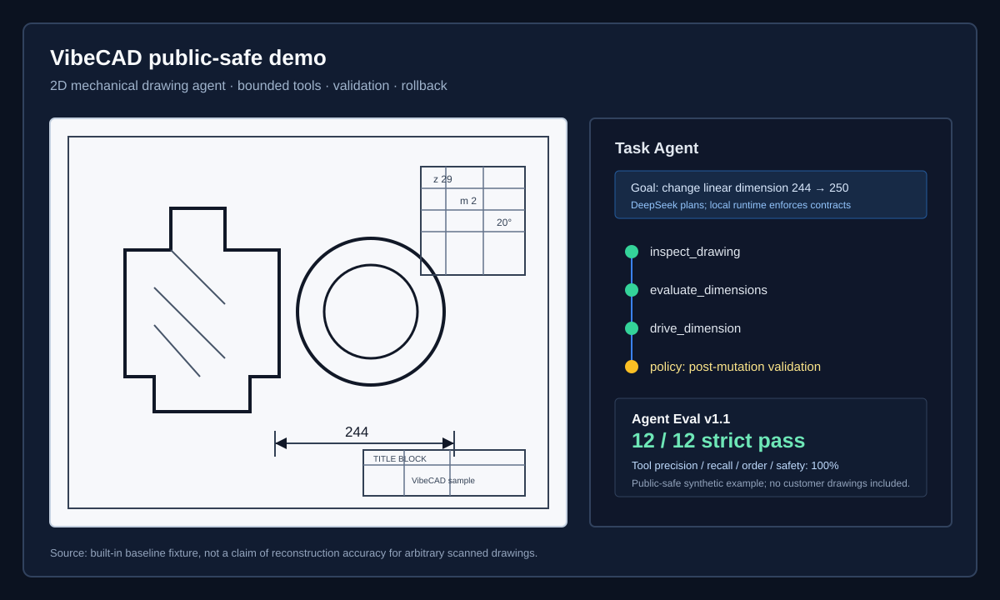
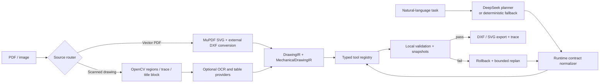

# VibeCAD

> A verifiable, rollback-safe agent for 2D mechanical drawings.

VibeCAD turns a drawing PDF/image and natural-language instructions into a
bounded CAD workflow. It is designed as an Agent engineering project: the LLM
proposes a plan, while local tools own geometry, validation, persistence,
rollback, and DXF/SVG export.

The project currently supports a strong vector-PDF path and an experimental
scanned-drawing path. It is an MVP for agent research and portfolio use, not a
claim that arbitrary scanned mechanical drawings can be reconstructed into
production-ready CAD without review.



The visual above uses only the built-in synthetic baseline fixture. No uploaded
or third-party mechanical drawings are included in this repository.

## Why this exists

"Vibe coding" gives users a loop of intent, execution, inspection, and
iteration. VibeCAD explores the equivalent loop for 2D mechanical drawings:

1. Import a PDF or image.
2. Build a `DrawingIR` / `MechanicalDrawingIR` representation.
3. Ask for a constrained CAD change in Chinese or English.
4. Plan with DeepSeek or a deterministic fallback.
5. Execute only registered tools, validate each mutation, then export DXF/SVG.
6. Inspect the trace, diff, semantic objects, evaluation report, or roll back.

## Architecture



The important boundary is between planning and execution. The model never owns
arbitrary geometry mutation. It selects from typed tools, and the runtime
enforces the following contracts:

| Mutation | Required verification |
| --- | --- |
| `edit_cad` | `evaluate_drawing` checks entity-ID and numeric-geometry integrity |
| `repair_dimensions` | `evaluate_dimensions` before and after repair |
| `drive_dimension` | `evaluate_dimensions` before and after the geometry transaction |

If a post-mutation validation fails, the project snapshot is restored before
the Agent can replan. The trace records runtime-injected policy checks so an
LLM omission remains inspectable instead of silently becoming product behavior.

## Current capabilities

- Vector PDF route: MuPDF SVG preview, Inkscape/pstoedit/SVG-DXF converter
  fallback chain, and a locked reference-trace layer.
- Scanned route: OpenCV layout detection, trace/vectorization, primitive
  promotion, line-weight layers, title-block grid reconstruction, and optional
  OCR/table providers.
- Mechanical semantics: dimension text, arrowheads, dimension/extension lines,
  measured geometry, `MechanicalDimensionObject`, and native DXF dimension
  export where the semantic object is complete.
- Agent runtime: typed tools, task timeline, automatic validation injection,
  snapshot rollback, bounded replan, and deterministic offline fallback.
- Evaluation: a versioned 12-case Agent Eval set covering planning, editing,
  semantic drive/repair, safety, recovery, and export.

## Evaluation snapshot

`agent-tasks-v1.1` was run locally after the runtime contract layer was added:

| Mode | Strict pass | Tool precision / recall / order | Arguments | Safety |
| --- | ---: | ---: | ---: | ---: |
| Deterministic | 12 / 12 | 100% / 100% / 100% | 100% | 100% |
| DeepSeek V4 Flash | 12 / 12 | 100% / 100% / 100% | 100% | 100% |

The DeepSeek run averaged `1.17` LLM calls and `0.58` runtime-injected policy
checks per task. These are local MVP results on the included synthetic
fixtures, not a benchmark for arbitrary external drawings.

## Quick start

Prerequisites: Python 3.12, Node.js 20+, and macOS/Linux. The baseline runs
without an API key, OCR model, or model download.

```bash
git clone https://github.com/<your-account>/vibecad.git
cd vibecad
cp .env.example backend/.env

python3.12 -m venv backend/.venv
source backend/.venv/bin/activate
python -m pip install --upgrade pip
python -m pip install -r backend/requirements-dev.txt

cd frontend
npm ci
cd ..
```

Start the API and frontend in separate terminals:

```bash
PYTHONPATH=backend backend/.venv/bin/python -m uvicorn app.main:app --host 127.0.0.1 --port 8000
```

```bash
cd frontend && npm run dev
```

Open `http://127.0.0.1:5173`.

For a local smoke test plus both development servers, use `./run.sh`. It uses
Python 3.12 by default; set `PYTHON_BIN` when Python 3.12 lives elsewhere.

To enable DeepSeek planning, set `DEEPSEEK_API_KEY` in your local
`backend/.env`. The key stays local: `.env` is ignored and `.env.example`
intentionally contains an empty value only.

## Optional OCR and title-block models

The base dependencies deliberately exclude heavyweight OCR/table runtimes.
Install only the route you want:

```bash
# Chinese/English PaddleOCR for scanned drawings
backend/.venv/bin/python -m pip install -r backend/requirements-optional-ocr.txt

# Optional img2table provider for title blocks
backend/.venv/bin/python -m pip install -r backend/requirements-optional-table.txt
```

Paddle table-model download is disabled by default. To preload
`SLANeXt_wired` through ModelScope, install `modelscope` locally and use:

```bash
backend/.venv/bin/python -m pip install modelscope
modelscope download --model PaddlePaddle/SLANeXt_wired --local_dir ~/.paddlex/official_models/SLANeXt_wired
```

Model weights and local caches are excluded through `.gitignore`. Enabling
first-run model download requires an explicit local setting:

```bash
export VIBECAD_ALLOW_PADDLE_TABLE_MODEL_DOWNLOAD=1
```

For vector PDF conversion, install the desktop conversion tools separately:

```bash
brew install inkscape ghostscript pstoedit
```

## Test and build

```bash
PYTHONPATH=backend backend/.venv/bin/python -m pytest -q
cd frontend && npm run build
```

The GitHub Actions workflow runs this offline-safe test/build path. It does not
provide a DeepSeek key and explicitly disables Paddle model downloading.

## Scope and known limitations

- Vector PDFs preserve visual geometry much better than scanned drawings. For
  vector inputs, VibeCAD prefers mature SVG/DXF conversion over a handwritten
  PDF parser.
- Scan reconstruction remains experimental. Dense hatching, overlapping
  dimension annotations, arbitrary symbols, and low-quality scans may produce
  incorrect or incomplete editable geometry.
- OCR/table outputs are candidate semantics that require inspection. The title
  block uses its own CV grid reconstruction path before optional table models.
- The current dimension driver supports a deliberately narrow, validated
  subset of complete semantic dimensions. It does not infer manufacturing
  intent from every visible number.
- A DXF artifact may contain a locked reference-trace layer alongside editable
  entities. Matching the reference visually is not the same as reconstructing
  fully editable CAD semantics.

## Repository hygiene

The public repository intentionally excludes:

- API keys and local `.env` files.
- User uploads, generated project data, DXF/SVG previews, and smoke output.
- Paddle/model caches and common model-weight formats.
- Third-party source drawings unless their redistribution rights are clear.

Before adding a new example drawing, verify that it is your own work, public
domain, or explicitly licensed for redistribution.

## License

This project is released under the [MIT License](LICENSE).
